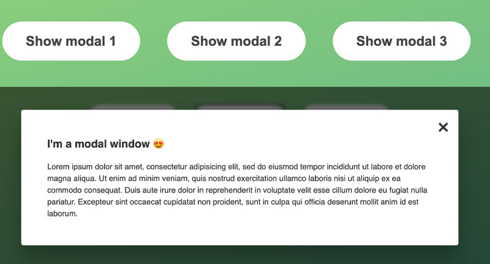

# js-modal
A vanilla JavaScript modal.

## How Its Done
Used querySelector() and querySelectorAll() to store DOM elements. Used addEventListener to listen for the click events and keydown event for the ESC key.
Passed the event to the callback function to find the key that was pressed, ESC key is e.key === 'Escape'.

